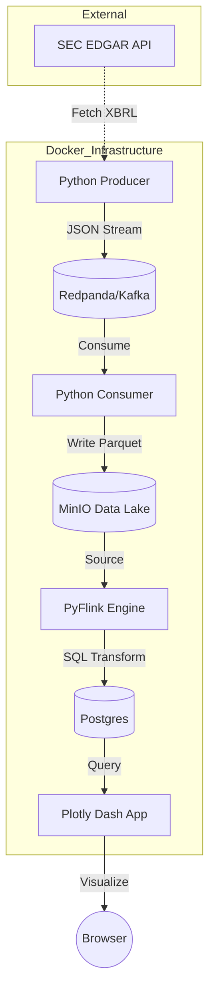

# Pyrex: SEC Financial Data Pipeline 🦖

A real-time data pipeline scrapping SEC EDGAR filings, streams them through Redpanda, stores them in a MinIO Data Lake, and processes them with Apache Flink for real-time Postgres analytics.

## 🏗 System Architecture



## 🛠 Tech Stack
- **Engine**: Apache Flink 2.2.0 (Java 17)
- **Messaging**: Redpanda (Kafka compatible)
- **Storage**: MinIO (S3) & PostgreSQL 16
- **Environment**: Python 3.12 (managed by `uv`)

## 🚀 Quick Start

### 1. Build & Launch
```bash
docker-compose build --no-cache
docker-compose up -d
```

### 2. Run the Pipeline
**Start Ingestion (Producer):**
```bash
docker exec -d pyrex-jobmanager-1 python /opt/src/extractions/producers/sec.py
```

**Start Data Lake Storage (Consumer):**
```bash
docker exec -d pyrex-jobmanager-1 python /opt/src/extractions/consumers/minio_consumer.py
```

**Run Flink Analytics:**
```bash
docker exec pyrex-jobmanager-1 flink run -py /opt/src/analytics/lake_to_postgres.py
```

## 🔍 Monitoring
- **Flink UI**: `http://localhost:8081`
- **MinIO UI**: `http://localhost:9001` (admin/password)
- **Dash Dashboard**: `http://localhost:8050` (after running dashboard script)


---

### 3. How to run the Dashboard
To see the data, run this in your terminal:

```bash
docker exec -d pyrex-jobmanager-1 python /opt/src/analytics/dashboard.py
```

Then open **`http://localhost:8050`** to see the analytical dashboard